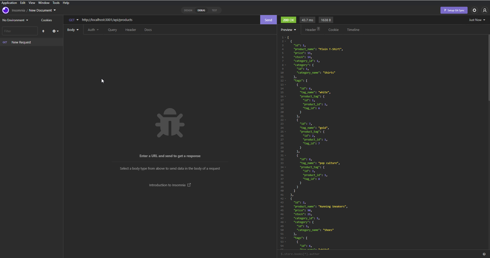

# **E-commerce Back End**
## using Object-Relational Mapping (ORM).

### **Project Description:**
This app is the back end for an e-commerce site for an internet retail company. It works using Express.js API and configures it to use Sequelize to interact with a MySQL database.

### **Technologies Used:**
This app uses these technologies to work properly:
- [JS] - Advanced JavaScript Language.
- Node.js
- Express.js
- MySQL database
- Sequelize

### **Walkthrough Video Link:**
https://drive.google.com/drive/folders/1vuFf8tQc2euFDq-eV7fD3F6JwSYgV6lw?usp=sharing

### **Credits:**
- [Sequelize](https://sequelize.org/ "Sequelize")
- [W3Schools](https://www.w3schools.com "W3Schools")
- [MDN Web Docs](https://developer.mozilla.org "MDN Web Docs")
- [Google](https://www.google.com "Google's Homepage")
- [Stack Overflow](https://stackoverflow.com "Stack Overflow website")
